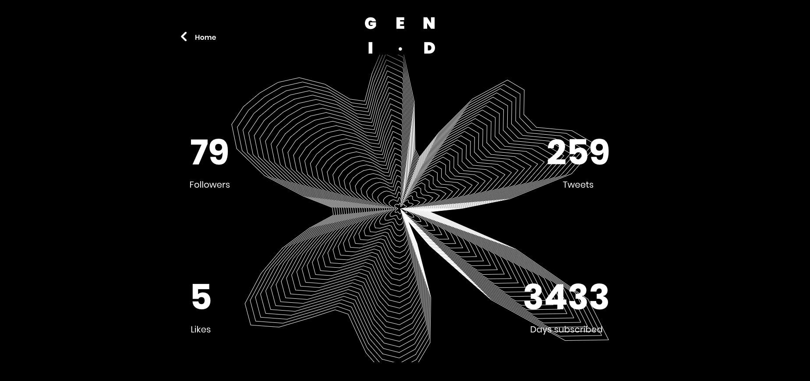

# Axigrow
> Experiment for GROW2017. Draw your twitter account with an axidraw. 



## Cncserver
Launch the Cncserver to connect your Axidraw api.

```sh
node cncserver --botType=axidraw --debug=true --httpLocalOnly=false
```

## Node server
Launch the Nodeserver to control your Axidraw.

```sh
node nodeserver({Axidraw IP Adress})
```

## Site

### Node server on localhost:3000
Launch the Node server to retrieve some datas from Twitter.
```sh
cd site
node server
```

### Website on localhost:8080
Launch the website to enter your Twitter account and start the experiment.

```sh
cd site
npm install
npm run dev
```

## Meta

Julien Espagnon – [@Julien_Espagnon](https://twitter.com/julien_espagnon) – [https://github.com/julienes](https://github.com/julienes/)

Arnaud Pinot – [@PinotArnaud](https://twitter.com/PinotArnaud) – [https://github.com/arnvvd](https://github.com/arnvvd/)